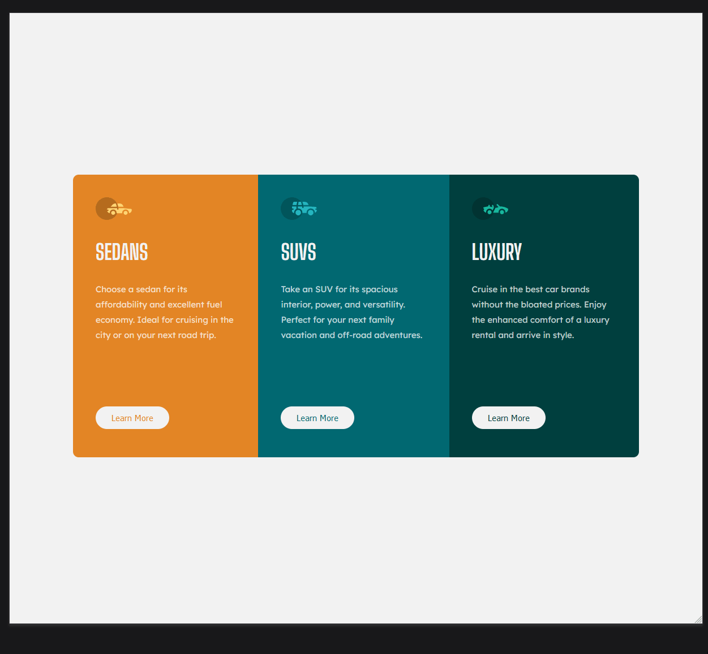

# Frontend Mentor - 3-column preview card component solution

This is a solution to the [3-column preview card component challenge on Frontend Mentor](https://www.frontendmentor.io/challenges/3column-preview-card-component-pH92eAR2-). Frontend Mentor challenges help you improve your coding skills by building realistic projects.

## Overview

### The challenge

Users should be able to:

- View the optimal layout depending on their device's screen size
- See hover states for interactive elements

### Screenshot



### Links

- Live Site URL: [https://selt0.github.io/3-column-preview/](https://selt0.github.io/3-column-preview/)

## My process

### Built with

- Semantic HTML5 markup
- CSS custom properties
- Flexbox
- CSS Grid
- Mobile-first workflow

### What I learned

Setting the columns to different colors along with the buttons was a little tedious. I had selected the col using CSS Pseudo-classes <code>:nth-child()</code>. There might've been a better way to select those elements that I'll need to check out later. It got really interesting when I had to specify the hover colors on the buttons. Luckily, I realized I could set the color of the buttons to <code>inherit</code> from it's parent element. I had to watch out for specificity so I ended up creating a class of 'btn' to match the specificity. Placing the hover at the bottom allowed it to override the original color


```css
.card .col:nth-child(1) {
  background-color: #e28525;
}
.col:nth-child(1) button {
  color: #e28525;
}

 button.btn:hover {
  border: 2px solid var(--light-gray);
  background-color: inherit;
  color: var(--light-gray);
  cursor: pointer;
}
```

### Continued development

I was a little hesitant on starting this project because of how 'simple' it looked. I told myself, well if it's so simple I should be able to code it out in under an hour. I want to continue practicing my development skills and I need to realize that any practice is good practice. I want to make web development my career so I should get used to doing all kinds of tasks, no matter how 'simple'.

## Author

- Website - [Michael Martinez](https://michael-martinez.netlify.app/)
- Twitter - [@MMocomochi](https://twitter.com/MMocomochi)
